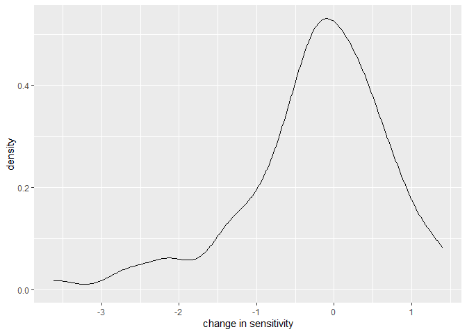
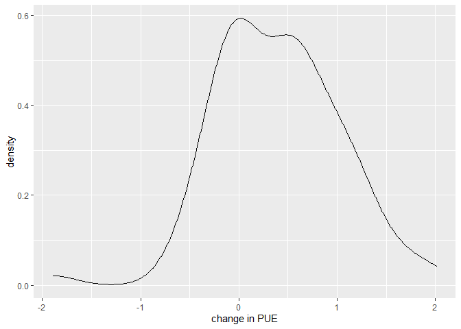
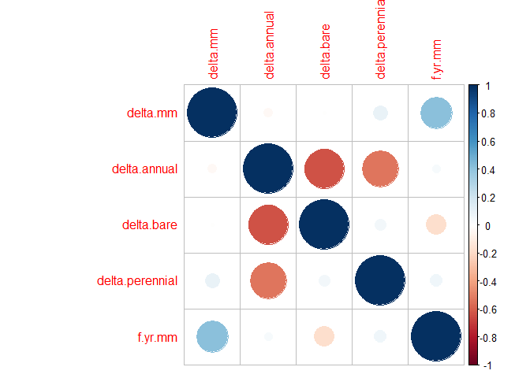
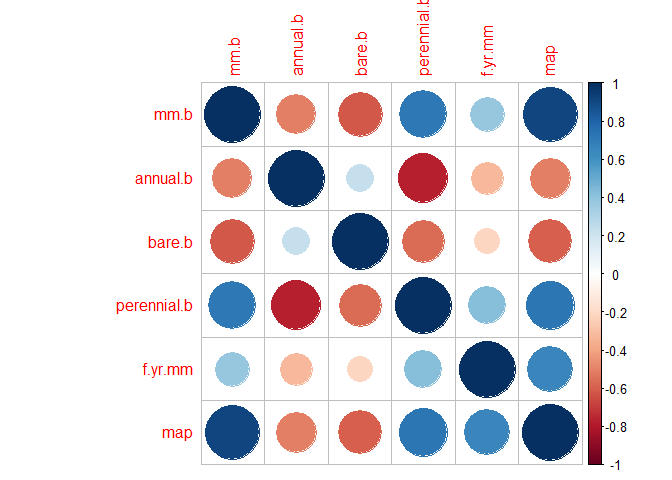

fire sensitivity project report
================
Tom Merchant, Elisa Van Cleemput
2021-03-03

The overall question we are try to answer is “how does fire alter the
production response to precipitation? And what site characteristics are
predictive of this shift?” To answer this we looked at two different
npp-precipitation relationship: Sensitivity and precipitation use
efficency (PUE).

### Question 1:

## Is there a shift in sensitivity or PUE before and after a fire.

``` r
#
```

``` r
#linear regression showing sensitivty as a function of fire occurance?
sens_change <- sens_predictors%>%
  gather( key = fire.occurance, value = sensitivity,  -fire.id, -fire.yr, -Fire_ID, - Acres, - StartMonth, - pre.npp, - pre.mm, -post.npp, -pre.annual, - pre.bare, -post.mm, -post.annual, -post.bare, -pre.perennial, -post.perennial, - f.yr.mm, - map, -delta.sens, - delta.annual, -delta.bare, -delta.mm, -delta.perennial, -map.s, -f.yr.mm.s,)

m.sens.change <- lmer(data = sens_change, sensitivity ~ fire.occurance + (1|fire.yr) + (1|Fire_ID))

summary(m.sens.change)
```

    ## Linear mixed model fit by REML ['lmerMod']
    ## Formula: sensitivity ~ fire.occurance + (1 | fire.yr) + (1 | Fire_ID)
    ##    Data: sens_change
    ## 
    ## REML criterion at convergence: 458.4
    ## 
    ## Scaled residuals: 
    ##      Min       1Q   Median       3Q      Max 
    ## -2.11562 -0.51437 -0.01749  0.50625  3.02810 
    ## 
    ## Random effects:
    ##  Groups   Name        Variance Std.Dev.
    ##  Fire_ID  (Intercept) 0.5906   0.7685  
    ##  fire.yr  (Intercept) 0.2944   0.5426  
    ##  Residual             0.4326   0.6577  
    ## Number of obs: 168, groups:  Fire_ID, 84; fire.yr, 7
    ## 
    ## Fixed effects:
    ##                        Estimate Std. Error t value
    ## (Intercept)              2.1750     0.2492   8.728
    ## fire.occurancepre.sens   0.2342     0.1015   2.307
    ## 
    ## Correlation of Fixed Effects:
    ##             (Intr)
    ## fr.ccrncpr. -0.204

``` r
#same for pue
pue_change <- pue_predictors%>%
  gather( key = fire.occurance, value = pue, - fire.yr, -Fire_ID)%>%
  filter(fire.occurance %in% c("pue.b", "pue.a"))
```

    ## Warning: attributes are not identical across measure variables;
    ## they will be dropped

``` r
m.pue.change <- lmer(data = pue_change, pue ~  fire.occurance + (1|fire.yr) + (1|Fire_ID))

summary(m.pue.change)
```

    ## Linear mixed model fit by REML ['lmerMod']
    ## Formula: pue ~ fire.occurance + (1 | fire.yr) + (1 | Fire_ID)
    ##    Data: pue_change
    ## 
    ## REML criterion at convergence: 397.2
    ## 
    ## Scaled residuals: 
    ##     Min      1Q  Median      3Q     Max 
    ## -1.6127 -0.4779  0.0085  0.4207  3.5120 
    ## 
    ## Random effects:
    ##  Groups   Name        Variance Std.Dev.
    ##  Fire_ID  (Intercept) 0.7008   0.8372  
    ##  fire.yr  (Intercept) 0.6590   0.8118  
    ##  Residual             0.1994   0.4466  
    ## Number of obs: 168, groups:  Fire_ID, 84; fire.yr, 7
    ## 
    ## Fixed effects:
    ##                     Estimate Std. Error t value
    ## (Intercept)          3.94239    0.33852  11.646
    ## fire.occurancepue.b -0.39810    0.06891  -5.777
    ## 
    ## Correlation of Fixed Effects:
    ##             (Intr)
    ## fr.ccrncp.b -0.102

``` r
#visual density curves
ggplot(sens_predictors)+
  geom_density(aes(delta.sens))+
  xlab("change in sensitivity")
```

<!-- -->

``` r
ggplot(pue_predictors)+
  geom_density(aes(pue.d))+
  xlab("change in PUE")
```

<!-- -->

Both theses metrics shift slightly before and after a fire. This effect
is only seen in sensitivity when including a random effect at the fire
level (I think this is the same as a paired T). It is interesting that
they seem to shift the the opposite directions. I think overall this may
tell us that sites become more productive overall and vary less between
years.

### Question 2:

## What is driving these shifts?

Again let’s start with sensitivity. The explanatory variables we were
interested in testing are: the change in bare ground, annual, and
perennial cover, the change in precipiation, the characteristics of the
fire year (precip), and the severity of the fire (not yet included).

first lets start with a correlation plot

``` r
corrplot(cor(sens_predictors[,c('delta.mm', 'delta.annual', 'delta.bare', 'delta.perennial', 'f.yr.mm')]))
```

<!-- -->

Here are a few models we tested.

``` r
#only random effects
m.ran <- lmer( data = sens_predictors, delta.sens ~ (1|fire.yr))

#only annual cover change
m.1 <- lmer(data = sens_predictors, delta.sens ~ delta.annual + (1|fire.yr))

#only bare cover change
m.2 <- lmer(data = sens_predictors, delta.sens ~ delta.bare +   (1|fire.yr))

#only perennial cover change
m.3 <- lmer( data = sens_predictors, delta.sens ~delta.perennial + (1|fire.yr))

#fire year precipitation
m.4 <- lmer( data = sens_predictors, delta.sens ~ f.yr.mm.s + (1|fire.yr))

# change in precipitation
m.5 <- lmer(data = sens_predictors, delta.sens ~ delta.mm + (1|fire.yr))

#annual change + fire year precipitation
m.6 <- lmer(data = sens_predictors, delta.sens ~ delta.annual + f.yr.mm.s + (1|fire.yr))

#Annual and bare change 
m.7 <- lmer(data = sens_predictors, delta.sens ~ delta.annual + delta.bare + (1|fire.yr))

#Annual and perennial change 
m.8 <- lmer(data = sens_predictors, delta.sens ~ delta.annual + delta.perennial + (1|fire.yr))

#bare and perennial change
m.9 <- lmer(data = sens_predictors, delta.sens ~ delta.bare + delta.perennial + (1|fire.yr))

#size of fire as a temporary proxy for fire characteristics (maybe severity)
m.10 <- lmer(data = sens_predictors, delta.sens ~ Acres + (1|fire.yr))
```

    ## Warning: Some predictor variables are on very different scales: consider
    ## rescaling

``` r
AIC(m.1, m.2, m.3, m.4, m.5, m.6, m.7, m.8, m.9, m.10, m.ran)
```

    ##       df      AIC
    ## m.1    4 232.3184
    ## m.2    4 228.8314
    ## m.3    4 230.3542
    ## m.4    4 228.3470
    ## m.5    4 227.2246
    ## m.6    5 236.0439
    ## m.7    5 232.6659
    ## m.8    5 237.8096
    ## m.9    5 234.2769
    ## m.10   4 250.2800
    ## m.ran  3 224.6238

Based on the AIC the best performing model is the completely random
effects model. The next best are the change in precipiation and the bare
ground models.

Here are the summaries for those two models.

``` r
#bare ground model
summary(m.2) 
```

    ## Linear mixed model fit by REML ['lmerMod']
    ## Formula: delta.sens ~ delta.bare + (1 | fire.yr)
    ##    Data: sens_predictors
    ## 
    ## REML criterion at convergence: 220.8
    ## 
    ## Scaled residuals: 
    ##     Min      1Q  Median      3Q     Max 
    ## -3.3918 -0.3605  0.1654  0.4975  2.2193 
    ## 
    ## Random effects:
    ##  Groups   Name        Variance Std.Dev.
    ##  fire.yr  (Intercept) 0.1539   0.3923  
    ##  Residual             0.7031   0.8385  
    ## Number of obs: 84, groups:  fire.yr, 7
    ## 
    ## Fixed effects:
    ##             Estimate Std. Error t value
    ## (Intercept) -0.28183    0.19116  -1.474
    ## delta.bare  -0.05887    0.03658  -1.609
    ## 
    ## Correlation of Fixed Effects:
    ##            (Intr)
    ## delta.bare 0.128

``` r
#change in precip model
summary(m.5) #probably significant and indicates nonlinearity?
```

    ## Linear mixed model fit by REML ['lmerMod']
    ## Formula: delta.sens ~ delta.mm + (1 | fire.yr)
    ##    Data: sens_predictors
    ## 
    ## REML criterion at convergence: 219.2
    ## 
    ## Scaled residuals: 
    ##     Min      1Q  Median      3Q     Max 
    ## -3.8057 -0.3979  0.0934  0.6237  1.7219 
    ## 
    ## Random effects:
    ##  Groups   Name        Variance Std.Dev.
    ##  fire.yr  (Intercept) 0.1392   0.3731  
    ##  Residual             0.6547   0.8092  
    ## Number of obs: 84, groups:  fire.yr, 7
    ## 
    ## Fixed effects:
    ##              Estimate Std. Error t value
    ## (Intercept) -0.551169   0.208535  -2.643
    ## delta.mm    -0.012053   0.004027  -2.993
    ## 
    ## Correlation of Fixed Effects:
    ##          (Intr)
    ## delta.mm 0.495

Now let’s focus on changes in precipitation use efficiency and ask the
same question,

``` r
#completely random effects model 
m.ran.pue <- lmer( pue.d ~ (1|fire.yr), data = pue_predictors)      

#change in annual model
m.1.pue <- lmer( pue.d ~ annual.d + (1|fire.yr), data = pue_predictors)

#change in bare model
m.2.pue <- lmer( pue.d ~ bare.d + (1|fire.yr), data = pue_predictors)

#change in perennial model
m.3.pue <- lmer(pue.d ~ perennial.d + (1|fire.yr), data = pue_predictors)

#fire year precipitatoin
m.4.pue <- lmer(pue.d ~ f.yr.mm.s + (1|fire.yr), data = pue_predictors)

#change in perecipitation
m.5.pue <- lmer(pue.d ~ mm.d + (1|fire.yr), data = pue_predictors)

#annual + fire year precip
m.6.pue <- lmer(pue.d ~  annual.d + f.yr.mm.s + (1|fire.yr), data = pue_predictors)

#annual + bare
m.7.pue <- lmer(pue.d ~ bare.d + annual.d + (1|fire.yr), data = pue_predictors)

#annual + perennial
m.8.pue <- lmer(pue.d ~ annual.d + perennial.d + (1|fire.yr), data = pue_predictors)

#bare + perennial
m.9.pue <- lmer(pue.d ~ bare.d + perennial.d + (1|fire.yr), data = pue_predictors)

#create a annual/perennial metrci
pue_predictors <- pue_predictors%>%mutate(pere.annu = perennial.d/annual.d)
m.10.pue <- lmer(pue.d ~ pere.annu + (1|fire.yr), data = pue_predictors)


AIC(m.1.pue, m.2.pue, m.3.pue, m.4.pue, m.6.pue, m.7.pue, m.8.pue, m.9.pue, m.10.pue, m.ran.pue)
```

    ##           df      AIC
    ## m.1.pue    4 138.1292
    ## m.2.pue    4 146.1453
    ## m.3.pue    4 159.5007
    ## m.4.pue    4 164.6379
    ## m.6.pue    5 143.6632
    ## m.7.pue    5 142.1260
    ## m.8.pue    5 143.7418
    ## m.9.pue    5 149.2493
    ## m.10.pue   4 165.7675
    ## m.ran.pue  3 159.3661

It looks like there are a few models here that perform beter than the
random effects only model but it looks like the best model is the one
that include only annual change.

### Question 3:

## what charactersitics of the system or environment are predictive of resiliency?

Here is a correlation plot to start with.

``` r
corrplot(cor(pue_predictors[,c('mm.b', 'annual.b', 'bare.b', 'perennial.b', 'f.yr.mm', 'map')]))
```

<!-- -->

Here are some more mixed effects models to test this. Again lets start
with sensitivity

``` r
#pre-fire precipitation
m.1.sens <- lmer(data = sens_predictors, delta.sens ~ pre.mm + (1|fire.yr))

#pre-fire annual cover
m.2.sens <- lmer(data = sens_predictors, delta.sens ~ pre.annual + (1|fire.yr))

#pre-fire bare ground
m.3.sens <- lmer(data = sens_predictors, delta.sens ~ pre.bare + (1|fire.yr))

#pre-fire precipitation and annual cover.
m.4.sens <- lmer(data = sens_predictors, delta.sens ~ pre.mm + pre.annual + (1|fire.yr))

#pre-fire droughtyness 
sens_predictors <- sens_predictors%>%mutate(pre.mm.d = map-pre.mm)
m.5.sens <- lmer(delta.sens ~ pre.mm.d + (1|fire.yr), data = sens_predictors)


m.ran.sens <- lmer(delta.sens ~ (1|fire.yr), data = sens_predictors)


AIC(m.1.sens, m.2.sens, m.3.sens, m.4.sens, m.5.sens, m.ran.sens)
```

    ##            df      AIC
    ## m.1.sens    4 235.8444
    ## m.2.sens    4 233.0592
    ## m.3.sens    4 232.5451
    ## m.4.sens    5 242.7655
    ## m.5.sens    4 231.1018
    ## m.ran.sens  3 224.6238

here are the summaries of the two best models

``` r
summary(m.3.sens)#bare ground
```

    ## Linear mixed model fit by REML ['lmerMod']
    ## Formula: delta.sens ~ pre.bare + (1 | fire.yr)
    ##    Data: sens_predictors
    ## 
    ## REML criterion at convergence: 224.5
    ## 
    ## Scaled residuals: 
    ##     Min      1Q  Median      3Q     Max 
    ## -3.4201 -0.4256  0.1605  0.5753  1.9652 
    ## 
    ## Random effects:
    ##  Groups   Name        Variance Std.Dev.
    ##  fire.yr  (Intercept) 0.1666   0.4081  
    ##  Residual             0.7222   0.8498  
    ## Number of obs: 84, groups:  fire.yr, 7
    ## 
    ## Fixed effects:
    ##              Estimate Std. Error t value
    ## (Intercept) -0.085755   0.435353  -0.197
    ## pre.bare    -0.007725   0.019072  -0.405
    ## 
    ## Correlation of Fixed Effects:
    ##          (Intr)
    ## pre.bare -0.893

``` r
summary(m.5.sens)#relative drought
```

    ## Linear mixed model fit by REML ['lmerMod']
    ## Formula: delta.sens ~ pre.mm.d + (1 | fire.yr)
    ##    Data: sens_predictors
    ## 
    ## REML criterion at convergence: 223.1
    ## 
    ## Scaled residuals: 
    ##     Min      1Q  Median      3Q     Max 
    ## -3.6790 -0.4208  0.0634  0.6710  1.7709 
    ## 
    ## Random effects:
    ##  Groups   Name        Variance Std.Dev.
    ##  fire.yr  (Intercept) 0.1607   0.4009  
    ##  Residual             0.6883   0.8296  
    ## Number of obs: 84, groups:  fire.yr, 7
    ## 
    ## Fixed effects:
    ##              Estimate Std. Error t value
    ## (Intercept) -0.355066   0.199439   -1.78
    ## pre.mm.d    -0.011142   0.005461   -2.04
    ## 
    ## Correlation of Fixed Effects:
    ##          (Intr)
    ## pre.mm.d 0.274

Nothing here does a good job explaining shifts in sensitivity

Let’s move on to precipitation use efficiency

``` r
#droughtyness? pre fire 
m.1.res <- lmer(pue.d ~ mm.b+(1|fire.yr), data = pue_predictors)

#does invasion before fire affect the change in functioning post fire?
m.2.res <- lmer(pue.d ~ annual.b+(1|fire.yr), data = pue_predictors)

#bare ground 
m.3.res <- lmer(pue.d ~ bare.b+(1|fire.yr), data = pue_predictors)

#pre-fire precipitation and annual cover.
m.4.res <- lmer(pue.d ~ mm.b +  annual.b + (1|fire.yr), data = pue_predictors)

#relative droughtyness
pue_predictors <- pue_predictors%>%mutate(mm.b.d = map - mm.b)
m.5.res <- lmer(pue.d ~mm.b.d + (1|fire.yr), data = pue_predictors)

#bare plus relativel drought
m.6.res <- lmer(pue.d ~ mm.b.d + bare.b + (1|fire.yr), data = pue_predictors)

AIC(m.1.res, m.2.res, m.3.res, m.4.res, m.5.res, m.6.res, m.ran.pue)
```

    ##           df      AIC
    ## m.1.res    4 172.5565
    ## m.2.res    4 168.5126
    ## m.3.res    4 165.4641
    ## m.4.res    5 181.4141
    ## m.5.res    4 165.2472
    ## m.6.res    5 172.7321
    ## m.ran.pue  3 159.3661

Let’s look at the summary. The bare ground relationship becomes more
significant with all the data.

``` r
summary(m.3.res)
```

    ## Linear mixed model fit by REML ['lmerMod']
    ## Formula: pue.d ~ bare.b + (1 | fire.yr)
    ##    Data: pue_predictors
    ## 
    ## REML criterion at convergence: 157.5
    ## 
    ## Scaled residuals: 
    ##     Min      1Q  Median      3Q     Max 
    ## -2.9306 -0.5879 -0.1808  0.6118  2.7678 
    ## 
    ## Random effects:
    ##  Groups   Name        Variance Std.Dev.
    ##  fire.yr  (Intercept) 0.1505   0.3879  
    ##  Residual             0.3070   0.5541  
    ## Number of obs: 84, groups:  fire.yr, 7
    ## 
    ## Fixed effects:
    ##             Estimate Std. Error t value
    ## (Intercept)  0.70193    0.30769   2.281
    ## bare.b      -0.02166    0.01257  -1.723
    ## 
    ## Correlation of Fixed Effects:
    ##        (Intr)
    ## bare.b -0.836

``` r
summary(m.5.res)
```

    ## Linear mixed model fit by REML ['lmerMod']
    ## Formula: pue.d ~ mm.b.d + (1 | fire.yr)
    ##    Data: pue_predictors
    ## 
    ## REML criterion at convergence: 157.2
    ## 
    ## Scaled residuals: 
    ##      Min       1Q   Median       3Q      Max 
    ## -2.58549 -0.65115 -0.03271  0.60251  2.76011 
    ## 
    ## Random effects:
    ##  Groups   Name        Variance Std.Dev.
    ##  fire.yr  (Intercept) 0.3684   0.6070  
    ##  Residual             0.2821   0.5311  
    ## Number of obs: 84, groups:  fire.yr, 7
    ## 
    ## Fixed effects:
    ##              Estimate Std. Error t value
    ## (Intercept)  0.110691   0.248170   0.446
    ## mm.b.d      -0.012550   0.004652  -2.698
    ## 
    ## Correlation of Fixed Effects:
    ##        (Intr)
    ## mm.b.d 0.175
